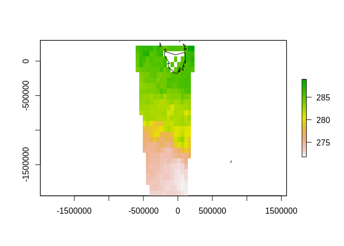

<!-- README.md is generated from README.Rmd. Please edit that file -->

# dirigible

<!-- badges: start -->

<!-- badges: end -->

GDAL headers for R. (A fresh attempt at vapour with a firmer re-use
basis).

## Installation

TBD but don’t do it this will break your system

## Example

Linux only for now.

``` r
library(dirigible)
f <- system.file("extdata/tab/list_locality_postcode_meander_valley.tab", package = "vapour")

## name of driver in use
dirigible:::driver_gdal_cpp(f)
#> [1] "MapInfo File"

## layer feature count
dirigible:::feature_count_gdal_cpp(f, layer = 0)
#> [1] 58

## vector layer names
dirigible:::layer_names_gdal_cpp(f)
#> [1] "list_locality_postcode_meander_valley"

## report fields
dirigible:::report_fields_gdal_cpp(f, 0, sql = "")
#>     LOCAL_ID         NAME     POSTCODE     PLAN_REF     GAZ_DATE   NOM_REG_NO 
#>    "OFTReal"  "OFTString" "OFTInteger"  "OFTString"    "OFTDate"  "OFTString" 
#>          UFI   CREATED_ON    LIST_GUID   SHAPE_AREA    SHAPE_LEN 
#>  "OFTString"  "OFTString"  "OFTString"    "OFTReal"    "OFTReal"

## report fields
dirigible:::report_fields_gdal_cpp(f, 0, 
                sql = "SELECT FID, NAME FROM list_locality_postcode_meander_valley")
#>          FID         NAME 
#> "OFTInteger"  "OFTString"


## read fields
as.data.frame(dirigible:::read_fields_gdal_cpp(f, layer = 0, sql = "", limit_n = 1, skip_n = 0, ex = 0, fid_column_name = character(0)))
#>   LOCAL_ID     NAME POSTCODE PLAN_REF   GAZ_DATE NOM_REG_NO
#> 1   100422 Caveside     7304  CPR5322 1970-01-01       947L
#>                                      UFI          CREATED_ON
#> 1 {4a5db4da-ca19-41a0-8dd4-c28a14bbee18} 2016-03-04 10:42:37
#>                                LIST_GUID SHAPE_AREA SHAPE_LEN
#> 1 {839edd46-01a7-4a45-9d97-499962fa952b}      -9999  39785.88
 
## VSI list
u <- "/vsizip//vsicurl/http://dapds00.nci.org.au/thredds/fileServer/rr2/national_geophysical_compilations/http/radmap_v3_2015_filtered_dose/radmap_v3_2015_filtered_dose.ers.zip"
(paths <- dirigible:::vsi_list_gdal_cpp(u))
#> [1] "radmap_v3_2015_filtered_dose"     "radmap_v3_2015_filtered_dose.ers"
#> [3] "radmap_v3_2015_filtered_dose.isi" "radmap_v3_2015_filtered_dose.txt"

## sds
sdsfile <- system.file("extdata/gdal/sds.nc", package = "vapour", mustWork = TRUE)
dirigible:::sds_list_gdal_cpp(sdsfile)
#> [1] "SUBDATASET_1_NAME=NETCDF:\"/perm_storage/home/mdsumner/R/x86_64-pc-linux-gnu-library/4.0/vapour/extdata/gdal/sds.nc\":vv" 
#> [2] "SUBDATASET_1_DESC=[61x87] vv (64-bit floating-point)"                                                                     
#> [3] "SUBDATASET_2_NAME=NETCDF:\"/perm_storage/home/mdsumner/R/x86_64-pc-linux-gnu-library/4.0/vapour/extdata/gdal/sds.nc\":vv2"
#> [4] "SUBDATASET_2_DESC=[61x87] vv2 (64-bit floating-point)"


## read names
unlist(dirigible:::read_names_gdal_cpp(f, 
                            layer = 0, sql = "", 
                            limit_n = 10, 
                            skip_n = 0, ex = 0))
#>  [1]  1  2  3  4  5  6  7  8  9 10
osm <- system.file("extdata/osm/osm-ways.osm", package = "vapour", mustWork = TRUE)
unlist(dirigible:::read_names_gdal_cpp(osm, 
                            layer = 1,   ## layer 1 is 'lines'
                            sql = "", 
                            limit_n = 0, 
                            skip_n = 0, ex = 0))
#> [1] 100 101 102 103 104

## read proj info
names(dirigible:::projection_info_gdal_cpp(f, layer = 0, sql = ""))
#> Warning in dirigible:::projection_info_gdal_cpp(f, layer = 0, sql = ""): not
#> null
#> [1] "Proj4"      "MICoordSys" "PrettyWkt"  "Wkt"        "EPSG"      
#> [6] "XML"

## read gcp
gcpfile <- system.file("extdata/gcps/volcano_gcp.tif", package = "vapour", mustWork = TRUE)
dirigible:::raster_gcp_gdal_cpp(gcpfile)
#> $Pixel
#> [1]  0  5 20
#> 
#> $Line
#> [1]  0  5 15
#> 
#> $X
#> [1] 100 200 300
#> 
#> $Y
#> [1] 100 200 300
#> 
#> $Z
#> [1] 0 0 0
#> 
#> $CRS
#> [1] ""

## raster info
dirigible:::raster_info_gdal_cpp(gcpfile, FALSE)
#> $geotransform
#> [1] 0 1 0 0 0 1
#> 
#> $dimXY
#> [1] 20 15
#> 
#> $minmax
#> [1] NA NA
#> 
#> $tilesXY
#> [1] 20 15
#> 
#> $projection
#> [1] ""
#> 
#> $bands
#> [1] 1
#> 
#> $proj4
#> [1] ""
#> 
#> $nodata_value
#> [1] -3.4e+38
#> 
#> $overviews
#> [1] 0
dirigible:::raster_info_gdal_cpp(gcpfile, TRUE)$minmax
#> [1] 100 163

## an error, but ok
try(dirigible:::raster_info_gdal_cpp(sdsfile, FALSE))
#> Error in dirigible:::raster_info_gdal_cpp(sdsfile, FALSE) : 
#>   no rasters found in dataset


# read geometry
str(dirigible:::read_geometry_gdal_cpp(f, layer = 0, sql = "",
                         what = "geometry",
                         textformat = "json",
                         limit_n = 1, skip_n = 0, ex = 0))
#> List of 1
#>  $ : raw [1:19485] 01 03 00 00 ...

str(dirigible:::read_geometry_gdal_cpp(f, layer = 0, sql = "",
                         what = "text",
                         textformat = "json",
                         limit_n = 1, skip_n = 0, ex = 0))
#> List of 1
#>  $ : chr "{ \"type\": \"Polygon\", \"coordinates\": [ [ [ 454430.22, 5396950.82 ], [ 454430.86, 5396948.43 ], [ 454432.44"| __truncated__

str(dirigible:::read_geometry_gdal_cpp(f, layer = 0, sql = "",
                         what = "text",
                         textformat = "wkt",
                         limit_n = 1, skip_n = 0, ex = 0))
#> List of 1
#>  $ : chr "POLYGON ((454430.22 5396950.82,454430.86 5396948.43,454432.44 5396943.6,454434.6 5396937.44,454448.18 5396910.5"| __truncated__

str(dirigible:::read_geometry_gdal_cpp(f, layer = 0, sql = "",
                         what = "text",
                         textformat = "gml",
                         limit_n = 1, skip_n = 0, ex = 0))
#> List of 1
#>  $ : chr "<gml:Polygon><gml:outerBoundaryIs><gml:LinearRing><gml:coordinates>454430.22,5396950.82 454430.86,5396948.43 45"| __truncated__

## got to be longlat for kml (just fwiw)
f1 <- system.file("gpkg/nc.gpkg", package = "sf")

str(dirigible:::read_geometry_gdal_cpp(f1, layer = 0, sql = "",
                         what = "text",
                         textformat = "kml",
                         limit_n = 1, skip_n = 0, ex = 0))
#> List of 1
#>  $ : chr "<MultiGeometry><Polygon><outerBoundaryIs><LinearRing><coordinates>-81.4727554321289,36.2343559265137 -81.540840"| __truncated__

## sys
dirigible:::version_gdal_cpp()
#> [1] "GDAL 3.0.4, released 2020/01/28"
str(dirigible:::drivers_list_gdal_cpp())
#> List of 7
#>  $ driver : chr [1:226] "VRT" "DERIVED" "GTiff" "NITF" ...
#>  $ name   : chr [1:226] "Virtual Raster" "Derived datasets using VRT pixel functions" "GeoTIFF" "National Imagery Transmission Format" ...
#>  $ vector : logi [1:226] FALSE FALSE FALSE FALSE FALSE FALSE ...
#>  $ raster : logi [1:226] TRUE TRUE TRUE TRUE TRUE TRUE ...
#>  $ create : logi [1:226] TRUE FALSE TRUE TRUE FALSE FALSE ...
#>  $ copy   : logi [1:226] TRUE FALSE TRUE TRUE FALSE FALSE ...
#>  $ virtual: logi [1:226] TRUE FALSE TRUE TRUE TRUE TRUE ...

dirigible:::proj_to_wkt_gdal_cpp("+proj=laea +datum=WGS84")
#> [1] "PROJCS[\"unknown\",GEOGCS[\"unknown\",DATUM[\"WGS_1984\",SPHEROID[\"WGS 84\",6378137,298.257223563,AUTHORITY[\"EPSG\",\"7030\"]],AUTHORITY[\"EPSG\",\"6326\"]],PRIMEM[\"Greenwich\",0,AUTHORITY[\"EPSG\",\"8901\"]],UNIT[\"degree\",0.0174532925199433,AUTHORITY[\"EPSG\",\"9122\"]]],PROJECTION[\"Lambert_Azimuthal_Equal_Area\"],PARAMETER[\"latitude_of_center\",0],PARAMETER[\"longitude_of_center\",0],PARAMETER[\"false_easting\",0],PARAMETER[\"false_northing\",0],UNIT[\"metre\",1,AUTHORITY[\"EPSG\",\"9001\"]],AXIS[\"Easting\",EAST],AXIS[\"Northing\",NORTH]]"

## white zone
dirigible:::dirigible_unload_gdal()
try(dirigible:::layer_names_gdal_cpp(f))
#> Error in dirigible:::layer_names_gdal_cpp(f) : Open failed.
dirigible:::dirigible_load_gdal()
#> [1] TRUE
dirigible:::layer_names_gdal_cpp(f)
#> [1] "list_locality_postcode_meander_valley"
```

### Warping in memory

Very WIP, needs a lot of thought around UX.

``` r
tas_wkt <- "PROJCRS[\"unknown\",\n    BASEGEOGCRS[\"unknown\",\n        DATUM[\"World Geodetic System 1984\",\n            ELLIPSOID[\"WGS 84\",6378137,298.257223563,\n                LENGTHUNIT[\"metre\",1]],\n            ID[\"EPSG\",6326]],\n        PRIMEM[\"Greenwich\",0,\n            ANGLEUNIT[\"degree\",0.0174532925199433],\n            ID[\"EPSG\",8901]]],\n    CONVERSION[\"unknown\",\n        METHOD[\"Lambert Azimuthal Equal Area\",\n            ID[\"EPSG\",9820]],\n        PARAMETER[\"Latitude of natural origin\",-42,\n            ANGLEUNIT[\"degree\",0.0174532925199433],\n            ID[\"EPSG\",8801]],\n        PARAMETER[\"Longitude of natural origin\",147,\n            ANGLEUNIT[\"degree\",0.0174532925199433],\n            ID[\"EPSG\",8802]],\n        PARAMETER[\"False easting\",0,\n            LENGTHUNIT[\"metre\",1],\n            ID[\"EPSG\",8806]],\n        PARAMETER[\"False northing\",0,\n            LENGTHUNIT[\"metre\",1],\n            ID[\"EPSG\",8807]]],\n    CS[Cartesian,2],\n        AXIS[\"(E)\",east,\n            ORDER[1],\n            LENGTHUNIT[\"metre\",1,\n                ID[\"EPSG\",9001]]],\n        AXIS[\"(N)\",north,\n            ORDER[2],\n            LENGTHUNIT[\"metre\",1,\n                ID[\"EPSG\",9001]]]]"
prj <- "+proj=laea +lon_0=147 +lat_0=-42 +datum=WGS84"


f <- 1/10
dm <- as.integer(c(186, 298) * f)
gt <- c(-637239.4, 5030.0/f, 0.0, 261208.7, 0.0, -7760.0/f)

gt_dim_2ex <- function(x, dim) {
  xx <- c(x[1], x[1] + dim[1] * x[2]) - x[2]/2
  yy <- c(x[4] + dim[2] * x[6], x[4]) - x[6]/2
  raster::extent(c(xx, yy))
}

ex <- gt_dim_2ex(gt, dm)
f <- system.file("extdata", "sst.tif", package = "vapour")
vals <- dirigible:::warp_in_memory_gdal_cpp(f,source_WKT = "", 
                                            target_WKT = tas_wkt,
                                            target_geotransform = gt,
                             target_dim = dm, band = 1)

v <- vals[[1]]
v[v < 250] <- NA
library(raster)
#> Loading required package: sp
data("wrld_simpl", package = "maptools")
plot(setValues(raster(ex, nrows = dm[2], ncols = dm[1]), v))
plot(spTransform(subset(wrld_simpl, NAME == "Australia"), prj), add = TRUE)
```



-----

## Code of Conduct

Please note that the dirigible project is released with a [Contributor
Code of
Conduct](https://contributor-covenant.org/version/2/0/CODE_OF_CONDUCT.html).
By contributing to this project, you agree to abide by its terms.
